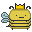

[![MIT License][license-shield]][license-url]
[![LinkedIn][linkedin-shield]][linkedin-url]

#readme-top

<!-- PROJECT LOGO -->
<br />
<div align="center">
  <a href="https://github.com/Roharx/ProjectBeeExam">
    
  </a>

<h3 align="center">Bees Project</h3>

  <p align="center">
    My personal project for my future bees 🐝    
  </p>
  <p align="center">
    This project is currently on hold so I can focus on my studies first.
  </p>  
</div>


<!-- TABLE OF CONTENTS -->
<details>
  <summary>Table of Contents</summary>
  <ol>
    <li>
      <a href="#about-the-project">About The Project</a>
    </li>
    <li>
      <a href="#getting-started">Getting Started</a>
      <ul>
        <li><a href="#prerequisites">Prerequisites</a></li>
        <li><a href="#installation">Installation</a></li>
      </ul>
    </li>
    <li><a href="#usage">Usage</a></li>
    <li><a href="#roadmap">Roadmap</a></li>
    <li><a href="#contributing">Contributing</a></li>
    <li><a href="#license">License</a></li>
    <li><a href="#contact">Contact</a></li>
    <li><a href="#acknowledgments">Acknowledgments</a></li>
  </ol>
</details>


<!-- ABOUT THE PROJECT -->
## About The Project

This is my personal project for a bee farm that I am planning to create around the age of 40-45. I apply different 
coding techniques and cool solutions that I learn from university and work, this is completely independent from
any companies and is an experimental project, acting as a playground.

<p align="right">(<a href="#readme-top">back to top</a>)</p>


<!-- GETTING STARTED -->
## Getting Started

To get a local copy up and running follow these simple steps.

### Prerequisites

This is an example of how to list things you need to use the software and how to install them.
* npm
  ```sh
  npm install npm@latest -g
  ```

### Installation

_Below is an example of how you can instruct your audience on installing and setting up your app. This template doesn't rely on any external dependencies or services._

1. Clone the repo
   ```sh
   git clone https://github.com/Roharx/ProjectBeeExam
   ```
2. Install NPM packages
   ```sh
   npm install
   ```


<p align="right">(<a href="#readme-top">back to top</a>)</p>


<!-- ROADMAP -->
## 1.0 Roadmap

- [x] Add Readme
- [x] Add back to top links
- [x] Construct database
- [x] Connect backend to database (PostgreSQL)
- [x] Build up backend
- [x] Create tests for backend in postman
- [ ] Finish up backend
- [x] Create frontend
- [x] Connect frontend and backend
- [x] Add UI
- [ ] Playwright tests for UI
- [ ] Bugfixes, more tests, wrapup to 1.0
- -----------------------------------------
## 2.0 Roadmap
- [ ] Make a placeholder/emergency UI for mobile view
- [ ] Start development on mobile app
- [ ] Evaluate the need for GraphQL
- [ ] If needed, change to GraphQL

<p align="right">(<a href="#readme-top">back to top</a>)</p>


<!-- CONTRIBUTING -->
## Contributing

Contributions for this project are not yet open but I welcome any suggestions at balint.imal@gmail.com.

<p align="right">(<a href="#readme-top">back to top</a>)</p>


<!-- LICENSE -->
## License

The readme file is distributed under the MIT License. See `LICENSE.txt` for more information.

<p align="right">(<a href="#readme-top">back to top</a>)</p>


<!-- CONTACT -->
## Contact

Bálint Farkas - [Bálint Farkas](https://www.facebook.com/ffbalint/) - balint.imal@gmail.com

Project Link - [Bees Project](https://github.com/Roharx/ProjectBeeExam)

<p align="right">(<a href="#readme-top">back to top</a>)</p>


<!-- ACKNOWLEDGMENTS -->
## Acknowledgments

* [Best Readme Template](https://github.com/othneildrew/Best-README-Template)

<p align="right">(<a href="#readme-top">back to top</a>)</p>


<!-- MARKDOWN LINKS & IMAGES -->
<!-- https://www.markdownguide.org/basic-syntax/#reference-style-links -->
[license-shield]: https://img.shields.io/github/license/othneildrew/Best-README-Template.svg?style=for-the-badge
[license-url]: https://github.com/othneildrew/Best-README-Template/blob/master/LICENSE.txt
[linkedin-shield]: https://img.shields.io/badge/-LinkedIn-black.svg?style=for-the-badge&logo=linkedin&colorB=555
[linkedin-url]: https://www.linkedin.com/in/balintjanosfarkas/
[product-screenshot]: images/screenshot.png
